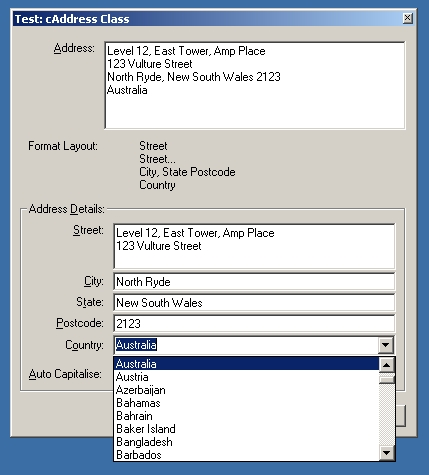



## Address Class v1\.0\.1

### Description

This class is great for use with contact database programs. It's designed to take an address from a multiline textbox and break out the details to individual fields (Street, city, state, zip, country); criteria validation function that check for missing field; auto capitalisation; and fill a passed combobox with all known countries. Also takes multiple fields and returns a formatted address. The test application also demonstrates (for beginners) how to create an Auto-complete a ComboBox; Quick ComboBox search using API; Simple field hilighting methods for TextBox and ComboBox; Avoid complex If/Then structures using bitwise operation and the IIF function. The code is commented and clean - well worth the look. Please vote if you like it...
 
### More Info
 

             |
---                |---
**Submitted On**   |2001-08-04 13:48:32
**By**             |[Slider](https://github.com/Planet-Source-Code/PSCIndex/blob/master/ByAuthor/slider.md)
**Level**          |Intermediate
**User Rating**    |4.2 (59 globes from 14 users)
**Compatibility**  |VB 6\.0
**Category**       |[Data Structures](https://github.com/Planet-Source-Code/PSCIndex/blob/master/ByCategory/data-structures__1-33.md)
**World**          |[Visual Basic](https://github.com/Planet-Source-Code/PSCIndex/blob/master/ByWorld/visual-basic.md)
**Archive File**   |[Address Cl24054832001\.zip](https://github.com/Planet-Source-Code/slider-address-class-v1-0-1__1-25807/archive/master.zip)

